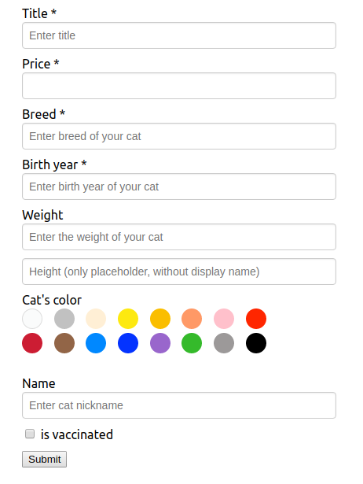
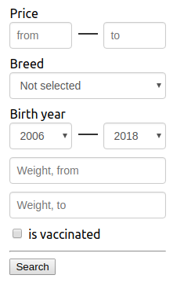

# Capybara forms
Dynamic Django forms and filters using JSON schema.

If you have 2 models: Category and Entry.
And some entry features depends on it's category.
Using this library, you will obtain easy-to-configure
schema with form, filter and entry fields generators.
Also, it can work with model fields.

# Quick start
<span>1.</span> Define your models
```python
from django.db import models
from capybara_forms.models import CapybaraFormsCategory, CapybaraFormsModel


class Category(CapybaraFormsCategory):
    title = models.CharField(max_length=100)
    
class Advert(CapybaraFormsModel(Category)):
    # Global model fields
    title = models.CharField(max_length=100)
    price = models.PositiveSmallIntegerField()
    # Rest fields will be stored in JSON 'data' field
```

<span>2.</span> Write schema for category 'Cats'
```json
[
  {
    "name": "breed",
    "type": "string",
    "required": true,
    "display_name": "Breed",
    "placeholder": "Enter breed of your cat"
  },
  {
    "name": "year",
    "type": "number",
    "required": true,
    "max_value": 2020,
    "min_value": 1980,
    "placeholder": "Enter birth year of your cat",
    "display_name": "Birth year"
  },
  {
    "name": "weight",
    "type": "number",
    "placeholder": "Enter the weight of your cat",
    "display_name": "Weight"
  },
  {
    "name": "height",
    "type": "number",
    "placeholder": "Height (only placeholder, without display name)"
  },
  {
    "type": "color",
    "display_name": "Cat's color"
  },
  {
    "name": "name",
    "type": "string",
    "placeholder": "Enter cat nickname",
    "display_name": "Name"
  },
  {
    "name": "vaccinated",
    "type": "checkbox",
    "display_name": "is vaccinated"
  }
]
```

<span>3.</span> Create form. It's a basic rendering object
```python
from django import forms
from capybara_forms.forms import CapybaraFormsModelForm
from .models import Advert


class AdvertForm(CapybaraFormsModelForm):
    # This fields from model will be rendered using form.render_form
    fields_in_model = ['title', 'price']

    # For custom placeholder
    title = forms.CharField(widget=forms.TextInput(attrs={'placeholder': 'Enter title'}))

    class Meta:
        model = Advert
        fields = ('title', 'price')
```

<span>4.</span> Use this form in your view
```python
from django.shortcuts import render, get_object_or_404, redirect

from .models import Category
from .forms import AdvertForm


def add(request, category_id):
    category = get_object_or_404(Category, pk=category_id)
    if request.method == 'POST':
        form = AdvertForm(category, request.POST.dict())
        if form.is_valid():
            form.save()
            return redirect('/{0}/'.format(category_id))
    else:
        form = AdvertForm(category)

    return render(request, 'add.html', {
        'form': form,
    })
```

<span>5.</span> Render form in your template.
Note, that library uses [parsley](http://parsleyjs.org/)
for validation. All dependencies listed below
```html
<form method="POST" data-parsley-validate>
    
    {{ form.render_form | safe }}

    <button type="submit">Submit</button>
</form>
```

Result form: <br/>


Result filter, with similar schema, plus some in-form configuration: <br/>



# Dependencies
1. [Django](https://www.djangoproject.com/)
2. [jQuery](https://jquery.com/) (version 3.3.1 included)
3. [JSON editor](http://jsoneditoronline.org/) 
(version 5.9.6 included)
4. [parsley](http://parsleyjs.org/) (version 2.8.1 included)

# Documentation and full example
See [readthedocs](capybara-forms.readthedocs.io) for
API, advanced usage cases, parameters definition
and more information 

See [example project](https://github.com/kenny1992/capybara_forms_example) 
for all features, used in worked application


# Slogan
> _With goal to simplify, with love to capybaras_
